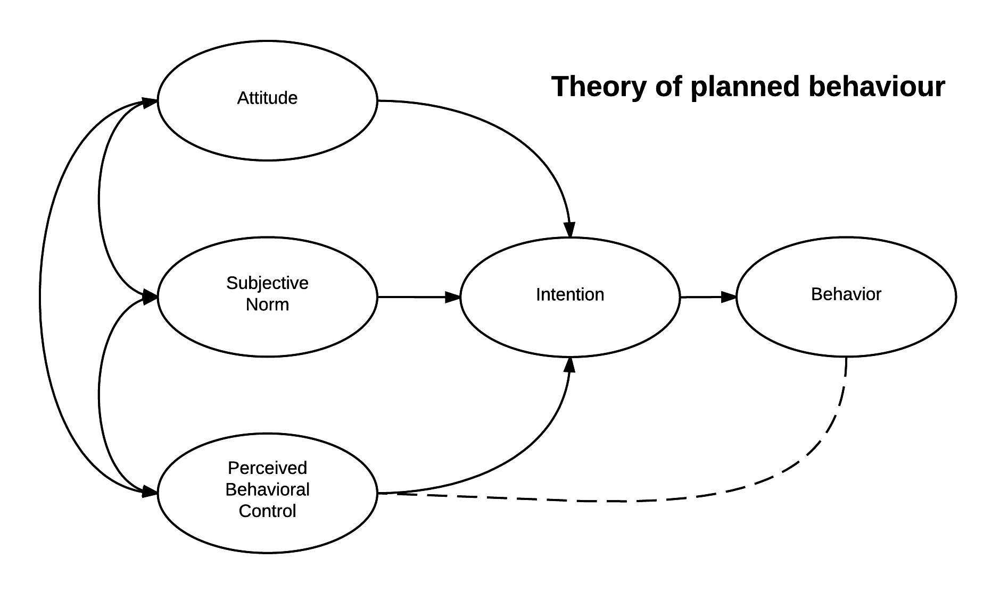

COM 1000 11-22-16
============================================================

## Mass Communication Research and Theory
- Fundamental ideas behind mass communication research
- The role of theory in mass communication research
- Two studies based on COM 1000 participants' involvement
- Perspective
    - People are producers as well as products of social systems
- What is a social system?
    - A pattern of connections among people, groups, organizations, and institutions
    - Family, government, religion, education, media

- Mass Communication Research
    - Attempts to understand and explain the role(s) the media play in our social systems, i.e. effects
    - Generally speaking... the cognitive, affective, and behavioral effects
    - Cognitive
        - 9/11, media influences ideas on what terrorism is
    - Affective
        - Harambe. Emotional responses.
        - Advertising, makes you feel good about something
    - Behavioral
        - Election response
        - Advertising tries to get you to act, behave, get something from store

- We develop, rely on, and refine **theory**
- What is a **theory**?
- A theory is a **framework** for observations and facts that provides a **causal explanation** for a **phenomenon** (e.g. effect).

- There are many theories that explain the relationships between media exposure and people's thoughts, feelings, and behaviors
- For example, here are two...

- Theory of planned behavior
    - Attitude toward a certain behavior
    - Subjective norms
    - Perceived behavioral control

    

- The study was looking at how social identification through music might relate to streaming service behavior
- Hypothesis: Social identification will be positively linked to subjective norms?
- Research question: If added to the model, will it help to explain the streaming behavior?

- Findings
    - Social identification & Subjective norms were related
        - (r = .30, p < .001)
        - r: Effect size
        - p: The likelihood that this would happen again next semester
    - Social identification is a significant factor explaining streaming behavior
        - B (beta): 0.08
            - Importance in the model
        - p < 0.05
            - The likelihood that this would happen again next semester
- One takeaway
    - Building features into the streaming services that help users start or participate in music-based 
    communities could lead to more
    use and increase potential revenues

- A study from fall of 2015 involved **Cultivation Theory**
> Important for exam

## Cultivation Theory
- It was developed in the 1960's
- Based on assumptions
- Television is a centralized system of storytelling
- TV replaced other primary sources in influencing predispositions and preferences
- TV programming was/is a prime source of socialization
- George Gerbner
    - Founder of the Cultivation Theory
- Main proposition
     - Media exposure over time leads to
        - The cultivation of shared conceptions of reality among otherwise diverse publics through 
        exposure to a similar system of programming
        - Or... perceptions of reality that are more like TV reality
- Two levels of Cultivation effects
- First order: Perceptions of prevalence
    - How common things might be
- Second orderL Attitudes
    - Ex. Attitudes toward government, education, politics...

- First order example
    - Estimates of the percentage of people who are lawyers, doctors, police officers
    - Estimates of how frequently crimes occur
    - Important factor: **Perceived Realism**

- Second order example
    - Mean world syndrome
    - People who watch a lot of programs like news, crime dramas, etc. are more likely to see the world as a 
    more dangerous and less trustworthy place.

## Cultivation Theory & COM 1000
- Favorite Programs
     - How many unique programs were mentioned?
        - 219 **unique** favorite programs

## Mean world syndrome
- First Order Effect
    - Hypothesis 1: There will be a positive relationship between viewing Law & Order: SVU and **estimates of murder/manslaughter** in Florida.
- Second Order Effect
    - Hypothesis 2: There will be a positive relationship between viewing Law & Order: SVU and **Mean World Syndrome**.

- H1: More Law & Order: SVU is linked to higher estimates of murder/manslaughter
    - r = .15, p < .05
    - Small correlation between viewership and estimates
- H2: more L&O: SVU is linked to stronger mean world syndrome
    - r = .12, p < .05

- Research Question 1: Will there be a positive relationship between viewing *The Walking Dead* and Mean World Attitude?
    - r = .11, p = .10
    - Not a significant relationship
    - No link was observed perhaps because TWD is low on perceived realism

- Important: Correlation ≠ Causation
- Takeaway... People's TV viewing is related to their perceptions of the world in such a way that their perceptions are more like TV reality
- Why does this matter?
